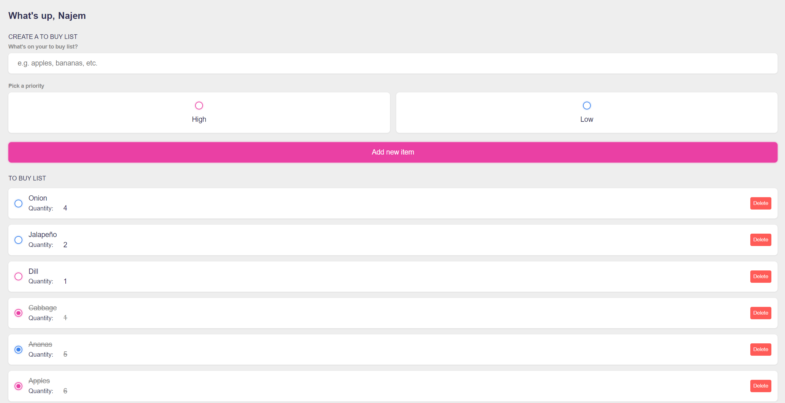

# To Buy List Web App 🛒

A simple and intuitive **To Buy List** web application built using Vue.js, allowing users to keep track of items they need to buy. The app supports adding items, categorizing them by priority, tracking their status, and updating their quantities. Each item is automatically saved to local storage, ensuring data persistence between sessions.

## Features ✨

- **Add Items**: Easily add new items to your list by entering the name and selecting a priority.
- **Quantity Tracking**: You can specify the quantity of each item. If you add an item that already exists, its quantity will be updated automatically.
- **Priority Levels**: Assign a priority (high or low) to each item to keep your list organized.
- **Mark as Done**: Check off items as you purchase them, keeping track of what you've bought.
- **Editable Quantities**: You can adjust the quantity of each item directly from the list.
- **Remove Items**: Delete items once they are no longer needed.
- **Data Persistence**: Your list is saved to local storage, so it remains available even after closing or refreshing the page.

## Technologies Used 🛠️

- **Vue.js**: Frontend framework used to build the reactive interface.
- **HTML5 & CSS3**: For structuring and styling the application.
- **Local Storage**: To persist data between sessions.
- **JavaScript (ES6)**: The logic behind the app functionality.

## Screenshot 📸



## Setup Instructions 🚀

1. Clone the repository:
   ```bash
   git clone https://github.com/najemhamo/ToBuyList.git
   ```
2. Navigate to the project directory:
   ```bash
   cd ToBuyList
   ```
3. Install dependencies:
   ```bash
   npm install
   ```
4. Run the app locally:
   ```bash
   npm run dev
   ```

## Future Enhancements 🔮

- **Drag & Drop Sorting**: Ability to reorder items by dragging and dropping.
- **Multiple Lists**: Support for managing multiple "To Buy" lists.
- **Cloud Sync**: Option to sync lists across devices with a cloud backend.

## Contributing 🤝

Contributions are welcome! Feel free to open an issue or submit a pull request with improvements.

---

Happy shopping! 🛍️
